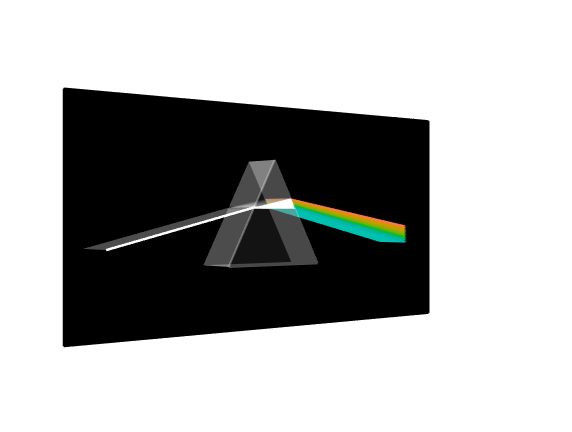
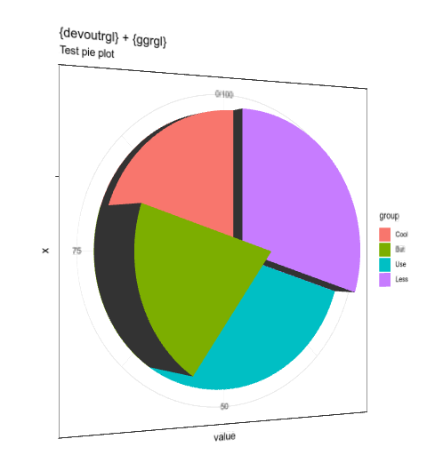
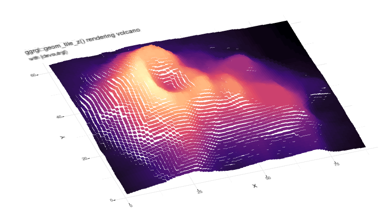
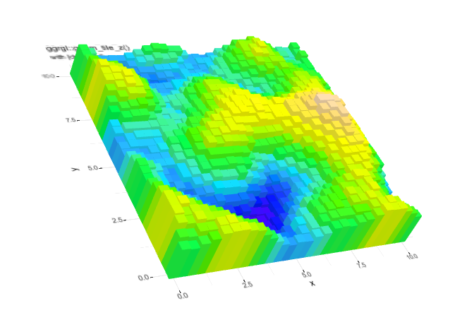
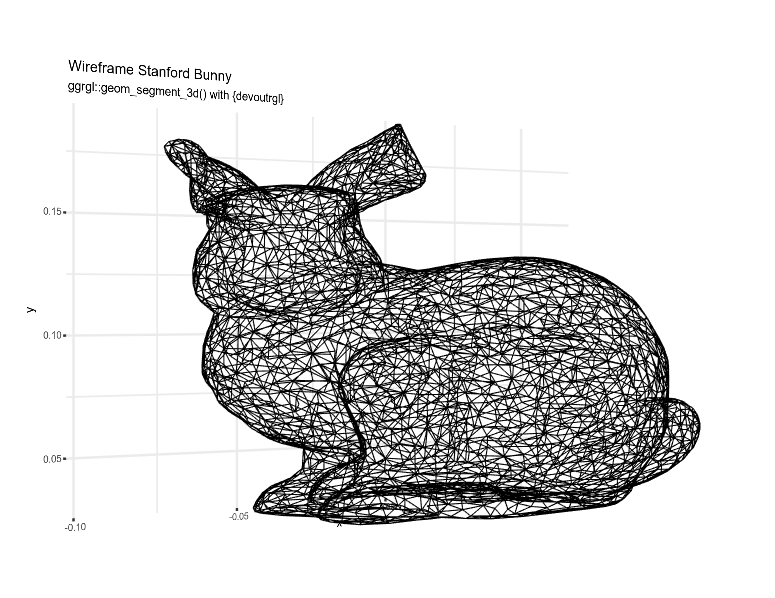
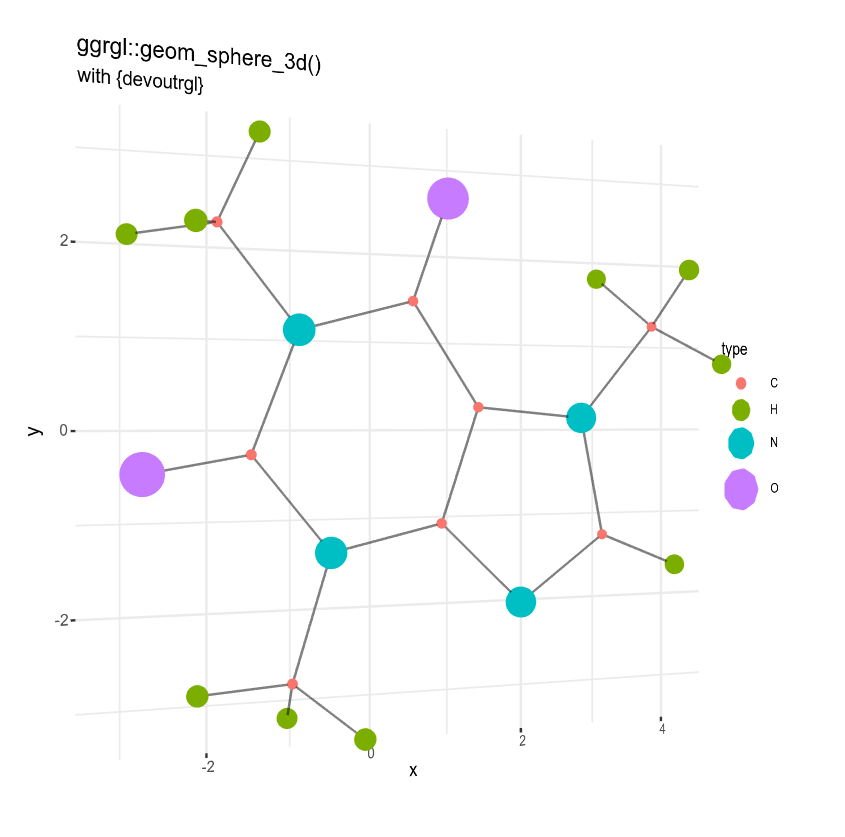
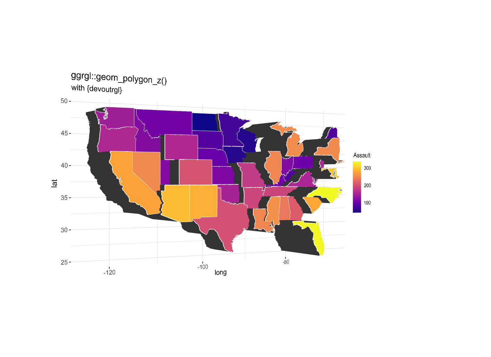

<!-- README.md is generated from README.Rmd. Please edit that file -->

# ggrgl 

<!-- badges: start -->

 [](https://www.tidyverse.org/lifecycle/#experimental)
<!-- badges: end -->

`ggrgl` extends [ggplot2](https://www.tidyverse.org/ggplot2) into the
third dimension.

`ggrgl` does this by adding a new **`z`** aesthetic which is respected
when a plot is rendered to the
[{devoutrgl}](https://github.com/coolbutuseless/devoutrgl) device which
renders to OpenGL via
[{rgl}](https://cran.r-project.org/web/packages/rgl/index.html).

Because `{devoutrgl}` is an interactive device, the view of the plot may
be manipulated by the user - zoom, rotate, change field-of-view etc.

#### Slideshow


<!-- #### Example Gif -->
<!-- <details open> -->
<!-- <summary> Click to hide/reveal an animated gif of a 3d plot </summary> -->
<!--  -->
<!-- </details> -->
<!-- <br/> -->

**Note:** interactive 3d plots cannot be displayed in a github README
file, and static images or animated gifs are used here instead.

Visit the [pkgdown online
documentation](https://coolbutuseless.github.io/package/ggrgl/) to view
plots which can be manipulated in the browser.

## Installation

A lot of support packages are needed for `ggrgl` - most of which should
already be installed if you have `ggplot`.

Custom packages which are needed (and not currently on CRAN):

-   [devout](https://github.com/coolbutuseless/devout) - The core
    package for writing graphics devices using R (rather than C).
-   [devoutrgl](https://github.com/coolbutuseless/devoutrgl) - a
    graphics device which renders to `{rgl}`
-   [triangular](https://github.com/coolbutuseless/triangular) -
    decompaose polygons into triangles for 3d rendering. Much faster
    than `rgl::triangulate()`
-   [snowcrash](https://github.com/coolbutuseless/snowcrash) - a package
    for encoding objects as images - needed to circumvent limitations in
    the device system provided by R
-   [cryogenic](https://github.com/coolbutuseless/cryogenic) - a package
    for capturing a call to be evaluated later. Calls to generate 3d
    geometry are generated when plot object is created, but not executed
    until later when the plot is actually rendered to screen.

You can install from [GitHub](https://github.com/coolbutuseless/ggrgl)
with:

``` r
# install.package('remotes')
remotes::install_github('coolbutuseless/devout')
remotes::install_github('coolbutuseless/devoutrgl')
remotes::install_github('coolbutuseless/triangular')
remotes::install_github('coolbutuseless/snowcrash')
remotes::install_github('coolbutuseless/cryogenic')
remotes::install_github('coolbutuseless/ggrgl', ref='main')
```

## New `z` Aesthetic

The new `z` aesthetic works the same as the `x` and `y` aesthetics in
`ggplot2`.

`z` may be mapped to a data variable or set to a constant.

## New Extrusion Aesthetics

When graphical elements have a `z` value they are raised above the
ground.

By setting `extrude = TRUE` (on geoms which support it), then the raised
element is connected to the ground as if it were extruded from it.

New aesthetics control the appearance of the extruded faces and edges:

| aesthetic             | Description                      | default |
|-----------------------|----------------------------------|---------|
| extrude\_z            | Lower limit of extrusion         | 0.05    |
| extrude\_face\_fill   | Extruded face colour             | grey20  |
| extrude\_face\_alpha  | Extruded face alpha              | 1       |
| extrude\_edge\_colour | Edge colour for extrusion        | NA      |
| extrude\_edge\_alpha  | Edge alpha for extrusion         | 1       |
| extrude\_edge\_size   | Width of line for extruded edges | 1       |

## 3-dimensional Geometry Types: `z` and `3d`

`ggrgl` defines 2 classes of geoms: `z` and `3d`

-   `z` geoms are identical to their `ggplot2` counterparts, except the
    entire shape may be raised (as a unit) in the z direction. The
    resulting geometry will still be planar, and parallel to the
    original plotting surface.
-   `3d` geoms allow for full specification of (x, y, z) locations.
    Their orientation is not constrained to be planar, or parallel to
    the original plotting surface.

**Click on a geom in the following table to view its vignette**

| ggplot2               | Planar Z offset                                                                                                | 3d                                                                                                |
|:----------------------|:---------------------------------------------------------------------------------------------------------------|:--------------------------------------------------------------------------------------------------|
| geom\_bar             | [geom\_bar\_z](https://coolbutuseless.github.io/package/ggrgl/articles/geom-bar-z.html)                        |                                                                                                   |
| geom\_contour         | [geom\_contour\_z](https://coolbutuseless.github.io/package/ggrgl/articles/geom-contour-z.html)                |                                                                                                   |
| geom\_contour\_filled | [geom\_contour\_filled\_z](https://coolbutuseless.github.io/package/ggrgl/articles/geom-contour-filled-z.html) |                                                                                                   |
| geom\_density         | [geom\_density\_z](https://coolbutuseless.github.io/package/ggrgl/articles/geom-density-z.html)                |                                                                                                   |
| geom\_line            |                                                                                                                | [geom\_line\_3d](https://coolbutuseless.github.io/package/ggrgl/articles/geom-line-3d.html)       |
| geom\_path            |                                                                                                                | [geom\_path\_3d](https://coolbutuseless.github.io/package/ggrgl/articles/geom-path-3d.html)       |
| geom\_point           | [geom\_point\_z](https://coolbutuseless.github.io/package/ggrgl/articles/geom-point-z.html)                    | [geom\_sphere\_3d](https://coolbutuseless.github.io/package/ggrgl/articles/geom-sphere-3d.html)   |
| geom\_polygon         | [geom\_polygon\_z](https://coolbutuseless.github.io/package/ggrgl/articles/geom-polygon-z.html)                |                                                                                                   |
| geom\_rect            | [geom\_rect\_z](https://coolbutuseless.github.io/package/ggrgl/articles/geom-rect-z.html)                      |                                                                                                   |
| geom\_ribbon          | [geom\_ribbon\_z](https://coolbutuseless.github.io/package/ggrgl/articles/geom-ribbon-z.html)                  |                                                                                                   |
| geom\_segment         |                                                                                                                | [geom\_segment\_3d](https://coolbutuseless.github.io/package/ggrgl/articles/geom-segment-3d.html) |
| geom\_text            | [geom\_text\_z](https://coolbutuseless.github.io/package/ggrgl/articles/geom-text-z.html)                      |                                                                                                   |
| geom\_tile            | [geom\_tile\_z](https://coolbutuseless.github.io/package/ggrgl/articles/geom-tile-z.html)                      |                                                                                                   |

## Vignettes

There are vignettes on all the new geoms in this package, see **links in
the table above** or **click on an image below**

Some vignettes with some details of the implementation and usage are:

-   [Technical
    Overview](https://coolbutuseless.github.io/package/ggrgl/articles/technical-overview.html)
    gives some details on how the 3d geometry is communicated internally
-   [Z
    Scaling](https://coolbutuseless.github.io/package/ggrgl/articles/details-z-scaling.html)
    shows examples how the scaling of the Z coordinate may be
    controlled.
-   [Keep 2d
    ‘shadows’](https://coolbutuseless.github.io/package/ggrgl/articles/details-keep2d.html)
    demonstrates how the 2d shadow of 3d geometry may be kept for some
    supported geoms.

To see all vignettes see the [online
documentation](https://coolbutuseless.github.io/package/ggrgl/)

|                                                                                                                                                                 |                                                                                                                                            |                                                                                                                      |
|:----------------------------------------------------------------------------------------------------------------------------------------------------------------|:-------------------------------------------------------------------------------------------------------------------------------------------|:---------------------------------------------------------------------------------------------------------------------|
| [](https://coolbutuseless.github.io/package/ggrgl/articles/demo-pink-floyd-dark-side-of-the-moon.html) | [](https://coolbutuseless.github.io/package/ggrgl/articles/demo-dna-model.html)                            | [](https://coolbutuseless.github.io/package/ggrgl/articles/geom-bar-z.html)          |
| [](https://coolbutuseless.github.io/package/ggrgl/articles/geom-ribbon-z.html)                                | [](https://coolbutuseless.github.io/package/ggrgl/articles/demo-volcano.html)                      | [](https://coolbutuseless.github.io/package/ggrgl/articles/geom-tile-z.html) |
| [](https://coolbutuseless.github.io/package/ggrgl/articles/geom-segment-3d.html)                                            | [](https://coolbutuseless.github.io/package/ggrgl/articles/demo-caffeine-molecule.html) | [](https://coolbutuseless.github.io/package/ggrgl/articles/geom-polygon-z.html)  |

## Example - A Basic 3d Bar Plot with `geom_bar_z()`

``` r
#~~~~~~~~~~~~~~~~~~~~~~~~~~~~~~~~~~~~~~~~~~~~~~~~~~~~~~~~~~~~~~~~~~~~~~~~~~~~
# Use `geom_bar_z` and set `z` to 200 and use extrusion
#~~~~~~~~~~~~~~~~~~~~~~~~~~~~~~~~~~~~~~~~~~~~~~~~~~~~~~~~~~~~~~~~~~~~~~~~~~~~
p <- ggplot(mpg) +
  geom_bar_z(aes(x=class, fill=class), colour='black', z=200, extrude=TRUE)


#~~~~~~~~~~~~~~~~~~~~~~~~~~~~~~~~~~~~~~~~~~~~~~~~~~~~~~~~~~~~~~~~~~~~~~~~~~~~
# Render Plot in 3d with {devoutrgl}
#~~~~~~~~~~~~~~~~~~~~~~~~~~~~~~~~~~~~~~~~~~~~~~~~~~~~~~~~~~~~~~~~~~~~~~~~~~~~
devoutrgl::rgldev()
p
invisible(dev.off())
```


## Related Software

-   [ggplot2](https://ggplot2.tidyverse.org) - a grammar of graphics
    implementation for 2d plots in R. `ggrgl` would be impossible
    without `ggplot2` to build upon.

## Acknowledgements

-   Hadley Wickham, Thomas Lin Pedersen and others for developing and
    maintaining `ggplot2`
-   Michael Sumner + Tyler Morgan-Wall on twitter for their in-depth
    technical advice on graphics and 3d in R
-   R Core for developing and maintaining the language.
-   CRAN maintainers, for patiently shepherding packages onto CRAN and
    maintaining the repository
